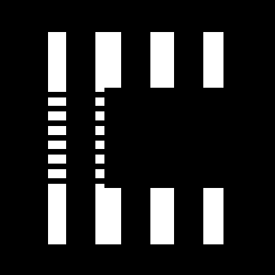

# Cision: AI-Powered Urban Road Safety Platform

<p align="center">
  
</p>

<p align="center">
  <strong>Cursor for City Planning</strong><br />
  Transform collision data into actionable, buildable intersection designs in minutes.
</p>

<p align="center">
  <a href="#-features">Features</a> •
  <a href="#-demo">Demo</a> •
  <a href="#-tech-stack">Tech Stack</a> •
  <a href="#-getting-started">Getting Started</a>
</p>

---

## The Problem

Every year, **1.35 million people die** in road traffic accidents globally. In Toronto alone, there are **50,000+ reported collisions annually**. The data exists: but it's trapped in spreadsheets, buried in bureaucracy, and disconnected from the planning decisions that could prevent deaths.

1. **Data Gap**: Collision data is abstract and scattered with no visual context
2. **Analysis Gap**: Safety audits take months and cost thousands of dollars
3. **Communication Gap**: Planners can't easily show stakeholders why changes matter

## Our Solution

**Cision** is an AI-powered urban planning platform that transforms raw collision data into interactive 3D visualizations, instant safety audits, and stakeholder-validated redesigns: all in minutes, not months.

### How It Works

```
┌─────────────────┐     ┌─────────────────┐     ┌─────────────────┐     ┌─────────────────┐
│  Collision Data │────▶│  3D Heatmap     │────▶│  AI Safety      │────▶│  AI Redesign    │
│  (Toronto Open  │     │  Visualization  │     │  Audit          │     │  Generator      │
│   Data)         │     │                 │     │  (6 metrics)    │     │                 │
└─────────────────┘     └─────────────────┘     └─────────────────┘     └─────────────────┘
                                                                   │
                                                                   ▼
                                                           ┌─────────────────┐
                                                           │  Voice Agent    │
                                                           │  Stakeholders   │
                                                           │  (Cyclist, Mayor,│
                                                           │   Engineer)     │
                                                           └─────────────────┘
```

---

## 🚀 Features

### 1. Interactive Collision Heatmap
- 3D MapGL visualization with clustered hotspots
- Color-coded by severity (green → red)
- Filter by collision type: fatalities, cyclist-involved, pedestrian-involved

### 2. AI Safety Audit
Instant safety audits with:
- 6 safety metrics (0-100 scale): Signage, Lighting, Crosswalk Visibility, Bike Infrastructure, Pedestrian Infrastructure, Traffic Calming
- 4-direction Street View composite
- Identified safety flaws with severity levels
- Improvement suggestions with priority, cost estimates, and expected impact

### 3. AI-Powered Intersection Redesign
- Natural language image generation for intersection transformations
- Version history carousel to compare designs
- Iterative refinement workflow

### 4. Multi-Persona Voice Agents
Three AI stakeholders (powered by ElevenLabs) provide instant feedback:
- **Amogh Merudi**: DoorDash Courier & Collision Survivor
- **Olivia Chow**: Mayor of Toronto
- **Marcus Chen**: Traffic Engineer, P.Eng.

### 5. Smart Intersection Search
- Search by intersection name or address with Google Places autocomplete
- Keyboard navigation and recent search history

### 6. Collision Statistics Dashboard
- Date range analysis and victim breakdown
- Normalized severity scoring vs. city-wide data

---

## 🎥 Demo

**Watch our 3-minute demo:** 

[](https://youtu.be/Lu3QH05z3w4)


---

## 🛠 Tech Stack

### Frontend
- **Next.js 16** (App Router, React 19)
- **TypeScript**
- **React Map GL / Mapbox** (3D mapping)
- **Tailwind CSS** + **Framer Motion**
- **Zustand** (state management)
- **Vercel AI SDK**

### Backend & APIs
- **Next.js API Routes** (serverless)
- **MongoDB** (collision data storage)
- **Google Gemini** (safety audit & image generation)
- **ElevenLabs** (voice agents)
- **Google Places API** (autocomplete + place details)

### AI/ML
- **Nano Banana Pro** (image generation for redesigns)
- **OpenAI Vision** (Street View analysis)
- **Custom clustering algorithm** (collision hotspot detection)

### Infrastructure
- **Vercel** (deployment)
- **Mapbox** (maps)
- **GitHub Actions** (CI/CD)

---

## 📁 Project Structure

```
cision/
├── app/
│   ├── api/                # API routes (chat, clusters, safety-audit, etc.)
│   ├── map/                # Main app page
│   └── page.tsx            # Landing page
├── components/
│   ├── map/                # Map components
│   ├── search/             # Search components
│   ├── sidebar/            # Sidebar components (intersection, persona, audit, chat)
│   └── ui/                 # Shared UI components
├── lib/                    # Utilities (clustering, prompts, etc.)
├── stores/                 # State management (Zustand)
└── types/                  # TypeScript type definitions
```

---

## 🚦 Getting Started

### Prerequisites
- Node.js 18+
- npm / yarn / bun
- Mapbox API token
- Google Gemini API key
- ElevenLabs API key
- Google Places API key (optional)

### Installation

```bash
# Clone the repository
git clone <repository-url>
cd cision

# Install dependencies
npm install

# Set up environment variables
# Create .env.local with:
NEXT_PUBLIC_MAPBOX_TOKEN=your_mapbox_token
GOOGLE_GEMINI_API=your_gemini_key
ELEVENLABS_API_KEY=your_elevenlabs_key
NEXT_PUBLIC_GOOGLE_PLACES_API_KEY=your_google_places_key

# Run development server
npm run dev
```

---

## 🙏 Acknowledgments

- **Toronto Open Data Portal** for collision data
- **Mapbox** for mapping tools
- **ElevenLabs** for voice synthesis
- **Google Gemini** for AI capabilities
- **DeltaHacks 2026** for the opportunity to build this

---

<p align="center">
  <strong>Built with ❤️ for safer cities</strong>
</p>
